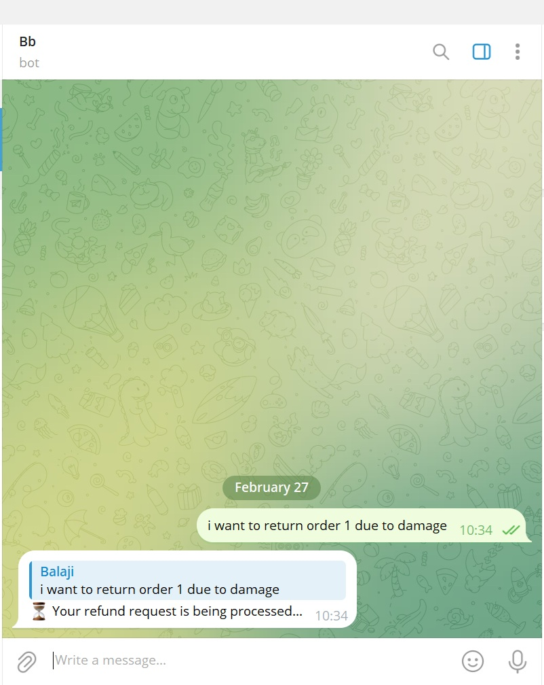

## Overview
This project consists of multiple microservices working together using Docker and NATS for communication. The services include an AI agent, refund API, Telegram bot, and PostgreSQL database.


## Repository Structure
```
/
├── aiagent/              # AI Agent service
├── refund_api/           # Refund API service
├── telegram_bot/         # Telegram bot service
├── .env                  # Environment variables (not to be committed)
├── .gitignore            # Git ignore file
├── docker-compose1.yml   # Docker Compose file
```

## Prerequisites
- Docker & Docker Compose
- Git

## Setup
1. Clone the repository:
   ```sh
   git clone <repository-url>
   cd <repository-folder>
   ```
2. Create a `.env` file and configure the necessary environment variables:
   ```sh
   TELEGRAM_BOT_TOKEN=your_token_here
   OPENAI_API_KEY=your_api_key_here
   NATS_SERVER="nats://nats:4222"
   ```
3. Start the services using Docker Compose:
   ```sh
   docker-compose -f docker-compose1.yml up -d
   ```

## Services
- **AI Agent**: Handles AI-related tasks.
- **Refund API**: Manages refund processing.
- **Telegram Bot**: Interfaces with users via Telegram.
- **NATS Server**: Message broker for inter-service communication.
- **PostgreSQL Database**: Stores refund-related data.

### AI agent
- Fetches historical refund data.
- Uses Z-Score and Isolation Forest to detect anomalies in refund requests.
- Calls OpenAI's GPT-4 API for AI-based fraud analysis.
- Makes final refund decisions based on ML and AI results.
- Communicates results via NATS messaging.

## Usage
- Access the Refund API at `http://localhost:8080`
- Monitor NATS at `http://localhost:8222`



## Contributing
1. Fork the repository.
2. Create a new feature branch.
3. Commit your changes.
4. Push to your branch and open a pull request.

## License
This project is licensed under [MIT License](LICENSE).

